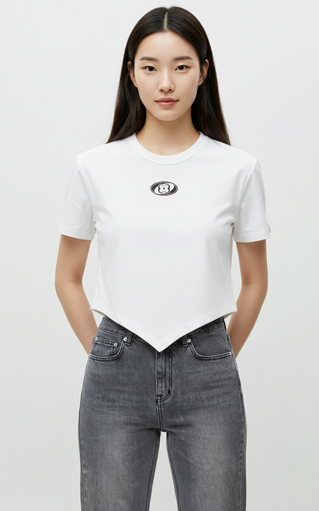
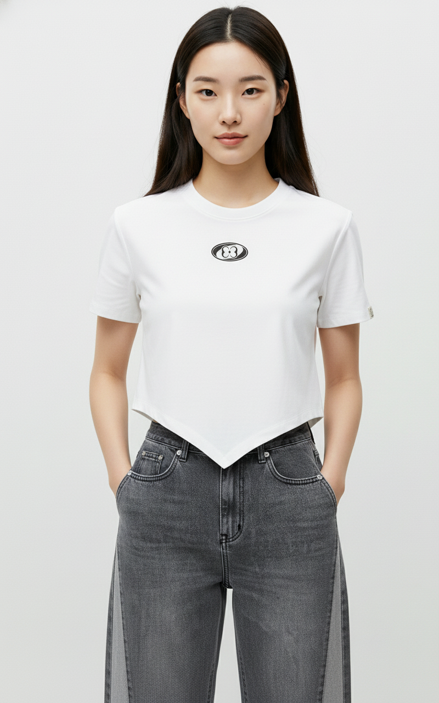

# 🌊 ALLBLUE — AI Fashion Orchestration Platform

> **파편화된 쇼핑을 단 하나의 룩으로 엮다.**
>
> 여러 셀러의 단품 데이터를 AI가 크로스 셀러 코디(룩북)로 합성하는
> 패션 오케스트레이션 플랫폼의 **백엔드 서버**입니다.

<br>

## 📌 프로젝트 핵심 요약

| 항목 | 내용 |
|------|------|
| **서비스 포지션** | 크로스 셀러 AI 룩북 오케스트레이터 |
| **핵심 차별점** | A셀러 상의 + B셀러 하의 + C셀러 신발 → AI가 하나의 룩북으로 합성 |
| **개발 인원** | 1인 (기획 · 백엔드 운영 · FE 단독 구현 · AI 워크플로우) |
| **개발 기간** | 2026.03 ~ (진행 중) |
| **전 프로젝트와의 관계** | [DEKK](https://github.com/potenup-dekk) 팀 프로젝트의 백엔드 인프라를 기반으로 1인 환경에서 AI 워크플로우·카페24 연동·기획 재정의를 추가 |

<br>

## 🎯 본 프로젝트에서 1인으로 진행한 작업

ALLBLUE는 DEKK 팀 프로젝트에서 출발하여 1인으로 분기한 프로젝트입니다.
어디까지가 팀 자산의 계승이고, 어디부터 1인 추가 작업인지를 명시합니다.

### ✅ 1인 신규 구현
| 영역 | 내용 |
|------|------|
| **AI 룩북 생성 워크플로우** | n8n + Gemini API 기반 비동기 이미지 합성 파이프라인 단독 구축 (재시도 스케줄러 포함) |
| **카페24 OAuth 연동** | 카페24 OAuth 2.0 인가코드 플로우 구현 · 토큰 발급/갱신 · 셀러 등록 (`SellerOAuthService`, `Cafe24ApiClient`) |
| **Admin 이미지 검수 파이프라인** | AI 검수 요청·콜백·상태 관리 흐름 (`AdminInspectionCommandService`, `InternalInspectionController`) |
| **프론트엔드** | Next.js 기반 FE를 기획부터 단독 구현 (DEKK FE는 랜딩 부재 — ALLBLUE FE는 새 기획) |
| **기획 재정의** | "단일 셀러 룩북 공유"(DEKK) → "크로스 셀러 AI 합성"(ALLBLUE)으로 컨셉 전환 |
| **자체 검토 시스템** | 별도 개발한 [Mirror Agent](https://github.com/woongblack/mirror-agent)로 본 README의 기획 맹점 자체 검증 |

### ✅ DEKK에서 본인이 구현한 것 (계승)
| 영역 | 내용 |
|------|------|
| **ADMIN 도메인** | 관리자 인증, 권한 관리, 대시보드 API |
| **USER 도메인** | 회원 가입/로그인/프로필, 인증 토큰 관리 |
| **Redis 도입** | 세션 관리, 토큰 저장소 설계 및 적용 |

### 📦 DEKK 팀에서 계승한 인프라 (직접 구현 X, 운영/이해 단계)
| 영역 | 내용 |
|------|------|
| **Spring Boot 기반 구조** | 기본 아키텍처 패턴 |
| **관측성 스택** | Prometheus + Grafana + Loki |

<br>

## 🏗️ 시스템 아키텍처 (현재 구현된 부분 기준)

```
┌─────────────┐     ┌──────────────────┐     ┌─────────────────┐
│   Next.js    │────▶│  Spring Boot API  │────▶│   PostgreSQL    │
│  (FE 신규)   │◀────│   (이 레포)       │────▶│     Redis       │
└─────────────┘     └────────┬─────────┘     └─────────────────┘
                             │
                    ┌────────┴──────────┐
                    ▼                   ▼
           ┌──────────────┐   ┌──────────────────┐
           │  n8n Worker   │   │  Cafe24 API       │
           │ (Gemini API)  │   │ (OAuth + 상품)    │
           │ (룩북 합성)    │   │                  │
           └──────┬───────┘   └──────────────────┘
                  │
                  ▼
         ┌──────────────┐
         │   로컬 스토리지 │
         │ (이미지 저장)   │
         └──────────────┘
```

> 현재 이미지는 로컬 파일 시스템에 저장합니다. AWS S3 마이그레이션은 Phase 3 계획.

<br>

## ⚙️ 기술 스택

### Core
| 기술 | 버전 |
|------|------|
| Java | 21 (LTS) |
| Spring Boot | 3.5 |
| Gradle | 8.x |

### Data & Cache
| 기술 | 용도 | 본인 작업 여부 |
|------|------|--------------|
| PostgreSQL | 비즈니스 데이터 | DEKK에서 도입 |
| Redis | 세션 · 토큰 저장 | **DEKK에서 본인 도입** |
| AWS S3 | 이미지 저장 (예정) | Phase 3 계획 |

### AI Workflow (1인 신규)
| 기술 | 용도 |
|------|------|
| **n8n** | AI 이미지 생성 워크플로우 오케스트레이션 |
| **Gemini API** | 크로스 셀러 룩북 이미지 합성 |
| **Webhook 콜백** | n8n → Spring Boot 비동기 결과 수신 |

### Infra & Observability
| 기술 | 용도 |
|------|------|
| Docker Compose | 로컬·운영 환경 |
| GitHub Actions | CI 파이프라인 |
| AWS EC2 / CodeDeploy | 운영 인프라 |
| Prometheus + Grafana + Loki | 관측성 (DEKK 계승) |

<br>

## 🔥 1인 환경에서 새로 구축한 것

### 1. n8n 기반 AI 룩북 생성 워크플로우

> **문제**: DEKK 시절에는 단일 셀러 룩북 공유 모델이라 AI 합성 로직이 없었음. ALLBLUE의 "크로스 셀러 합성" 컨셉을 실현하려면 외부 AI API 오케스트레이션 파이프라인이 필요했음.

**해결**: n8n을 워크플로우 오케스트레이터로 도입, Spring Boot는 비즈니스 로직만 담당하도록 분리

```
[사용자 룩북 요청]
        │
        ▼
LookbookCommandService (Spring Boot)
        │ 상태: PENDING
        ▼
LookbookAiPipelineService → Webhook 호출
        │
        ▼
   ┌──────────────┐
   │  n8n Worker   │  ← 1인 신규 구축
   │              │
   │  1. 셀러별 상품 이미지 수집
   │  2. Gemini API 프롬프트 구성
   │  3. 룩북 이미지 합성 호출
   │  4. 로컬 스토리지 저장
   │  5. 결과 콜백
   └──────┬───────┘
          ▼
   InternalLookbookController (Callback)
          │ 상태: COMPLETED / FAILED
          ▼
   재시도 스케줄러 (10분 초과 PENDING → 최대 3회 재시도 → FAILED)
```

**왜 n8n인가:**
- Spring Boot에 이미지 생성 로직을 직접 두면 LLM 호출 시 백엔드 스레드 점유
- n8n으로 워크플로우 분리 → Spring Boot는 트랜잭션/비즈니스 로직, n8n은 외부 API 오케스트레이션
- 향후 워크플로우 변경 시 n8n GUI에서 코드 없이 수정 가능

**현재 구현 상태:** Phase 1 PoC 완료. 단일 룩북 합성 동작 검증.

**실제 합성 결과물 (n8n + Gemini API):**

| 룩북 예시 1 | 룩북 예시 2 |
|:-----------:|:-----------:|
|  |  |

> 상품 이미지 + 모델 이미지를 n8n 워크플로우가 Gemini API로 전달 → 합성 결과 반환 → Spring Boot 콜백 수신

---

### 2. 카페24 OAuth 2.0 셀러 연동

> **목적**: 카페24 입점 셀러의 상품 데이터를 수집하기 위한 OAuth 인가 흐름 구현

**구현 범위:**
- 인가 URL 생성 (`buildAuthorizationUrl`)
- 인가코드 → 액세스 토큰 교환 (`handleCallback`)
- 토큰 자동 갱신 (`refreshToken`)
- 셀러 정보 DB 저장 및 토큰 관리

**현재 구현 상태:** OAuth 플로우 구현 완료. 실제 셀러 상품 수집 로직은 Phase 3.

<br>

## 🪞 자체 검토 (Mirror Agent)

별도 개발 중인 [Mirror Agent](https://github.com/woongblack/mirror-agent)로 본 README를 자체 검토했습니다.
Mirror Agent는 1인 개발자가 자기 객관성 상실로 인해 놓치는 기획 맹점을 시스템화한 도구입니다.

**발견된 맹점 (11개 생성 → 9개 수용, Precision 82%)**

| # | 비판 | 판정 |
|---|------|------|
| 1 | 크로스 셀러 AI 룩북이 단일 셀러 쇼핑보다 전환율이 높다는 사용자 행동 증거 없음 | 수용 |
| 2 | Phase 1 실패 시 "룩북 합성 방식 재검토"는 더 근본적인 질문(왜 저장하지 않았는가)을 유예함 | 수용 |
| 3 | 카페24 API 연동 가능 ≠ 셀러 자발적 참여 — 공급자 확보 전략 부재 | 수용 |
| 4 | 커스텀 룩북 니즈가 사전 검증 없이 전제됨 | 수용 |
| 5 | 1인 기획의 검토 한계 (외부 피드백 없음) | 수용 |
| 6 | DEKK 인프라를 1인 환경에 그대로 가져온 결정 — 1인이 운영 가능한 범위인지 재검토 필요 | 수용 |
| 7 | 카페24 중심 범위 제한이 "크로스 셀러" 가치를 스스로 축소 | 수용 |
| 8 | 크롤링 병목 — 외부 API 의존도가 핵심 제약임에도 대응 계획 없음 | 수용 |
| 9 | SNS 저장률 5%가 "크로스 셀러 룩북 수요"를 검증하는지 불분명 | 수용 |

→ 실제 리포트: [data/reports/allblue-readme-snapshot/](https://github.com/woongblack/mirror-agent/blob/main/data/reports/allblue-readme-snapshot/20260425_040815_allblue-readme-snapshot.md)

**대응:** 9개 비판을 반영해 ALLBLUE의 상업적 방향을 보류하고,
**기술 탐구 + Mirror Agent 테스트베드**로 포지션을 재정의했습니다.

<br>

## 🗓️ 개발 로드맵

| Phase | 내용 | 상태 |
|-------|------|------|
| **Phase 1** | n8n AI 룩북 생성 PoC + 카페24 OAuth 구현 + FE 1인 구현 | ✅ 완료 |
| **Phase 2** | Mirror Agent 자체 검토 → 기획 재정의 | ✅ 완료 |
| **Phase 3** | 카페24 셀러 상품 수집 + AWS S3 마이그레이션 | 📋 계획 |
| **Phase 4** | 통합 결제 + 분산 트랜잭션 | 📋 계획 (현재 미구현) |
| **Phase 5** | 셀러 확장 + 수익화 | 📋 보류 — Mirror Agent 검토 결과 반영 |

> Phase 3 이후는 **사용자 니즈 검증이 선행**되어야 의미 있다고 판단,
> 현재는 기술 탐구 + 메타 도구 테스트베드로 재포지셔닝.

<br>

## 📂 관련 레포지토리

| 레포 | 설명 |
|------|------|
| **ALLBLUE-BE** (이 레포) | Spring Boot 백엔드 |
| **[ALLBLUE-FE](https://github.com/A-BLUE-PROJECT/A.BLUE-FE)** | Next.js FE (1인 신규 구현) |
| **[Mirror Agent](https://github.com/woongblack/mirror-agent)** | 자체 검토 도구 |
| **[DEKK (전 팀 프로젝트)](https://github.com/potenup-dekk/DEKK-BE)** | 본 프로젝트의 백엔드 기반 |

<br>

## 🧑‍💻 개발자

**1인 개발 (분기 후)** — DEKK 팀 프로젝트에서 백엔드 ADMIN/USER 도메인과 Redis를 도입했고,
ALLBLUE에서는 그 인프라를 1인 환경에서 운영하며 **n8n 기반 AI 워크플로우, 카페24 OAuth 연동, FE를 새로 구축**했습니다.

이 과정에서 1인 기획의 자기 객관성 상실 문제를 인식하여, 별도 [Mirror Agent](https://github.com/woongblack/mirror-agent)를 개발해 본 프로젝트의 맹점을 자체 검증했습니다.

<br>

---

<p align="center">
  <strong>ALLBLUE</strong> — Cross-Seller AI Lookbook Platform 🌊
</p>
