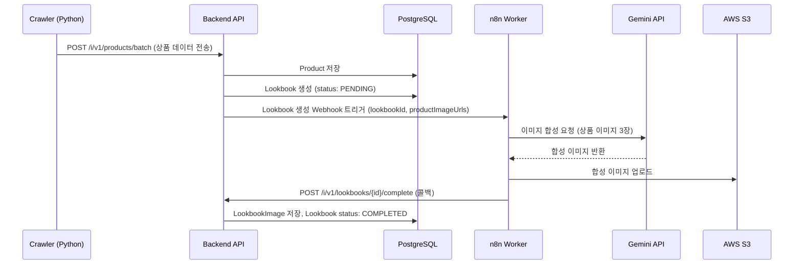

# Phase 0 — Lookbook 도메인 설계 (Blueprint)

**v1.2 | 2026.03.23**

> **MVP 범위 결정:** 커스텀 룩북(유저 직접 생성)은 MVP 제외. ALLBLUE가 AI로 생성한 콘텐츠만 제공하여 품질 통제 및 브랜드 포지셔닝 유지.

---

## 1. 제거 대상 (DEKK 잔재)

### 패키지
| 패키지 | 사유 |
| :--- | :--- |
| `com.allblue.card` | Lookbook으로 전면 교체 |
| `com.allblue.deck` | DEKK 전용 기능, ALLBLUE에 불필요 |
| `com.allblue.crawl` | 크롤링 방식 폐기 (Phase 3에서 Seller로 대체) |

### DB 테이블
| 테이블 | 처리 |
| :--- | :--- |
| `cards` | 제거 → `lookbooks` 신설 |
| `card_images` | 제거 → `lookbook_images` 신설 |
| `card_products` | 제거 → `lookbook_items` 신설 |
| `card_categories` | 제거 |
| `product_images` | 제거 → `products.product_image_url` 컬럼으로 통합 |
| `decks` | 제거 |
| `deck_cards` | 제거 |
| `crawl_batches` | 제거 |
| `crawl_raw_datas` | 제거 |

### 수정 대상 테이블
| 테이블 | 변경 내용 |
| :--- | :--- |
| `products` | 기존 컬럼 정리 + 신규 컬럼 추가 (seller_id, category, sale_price 등) |
| `active_logs` | `card_id` → `lookbook_id` 컬럼명 변경 |
| `users` | `height`, `weight` 컬럼 제거 → `fit_profiles` 테이블로 분리 |

---

## 2. 신규 도메인 모델

### Entity 관계도

```
sellers (Phase 3)
  └── products (seller_id FK, nullable until Phase 3)
        └── lookbook_items (product_id FK)
              └── lookbooks
                    └── lookbook_images (lookbook_id FK)

users
  └── fit_profiles (user_id FK)
  └── active_logs (user_id FK, lookbook_id FK)
```

### Lookbook

```
lookbooks
├── id                  BIGINT PK
├── style_type          VARCHAR   -- CASUAL | FORMAL | STREET | SPORTY
├── season              VARCHAR   -- SPRING | SUMMER | FALL | WINTER
├── target_gender       VARCHAR   -- WOMEN | MEN | UNDEFINED
├── tags                VARCHAR
├── status              VARCHAR   -- PENDING | COMPLETED | FAILED
├── created_at          TIMESTAMP
├── updated_at          TIMESTAMP
└── deleted_at          TIMESTAMP
```

> user_id 없음 — MVP는 ALLBLUE가 생성하는 콘텐츠만 제공. 커스텀 룩북 도입 시 추가.

### LookbookImage

```
lookbook_images
├── id                  BIGINT PK
├── lookbook_id         BIGINT FK UNIQUE
├── origin_url          TEXT      -- 합성 전 원본 이미지 URL
├── image_url           TEXT      -- AI 합성 완료 이미지 URL (S3)
├── created_at          TIMESTAMP
├── updated_at          TIMESTAMP
└── deleted_at          TIMESTAMP -- Soft Delete 적용
```

### LookbookItem

```
lookbook_items
├── id                  BIGINT PK
├── lookbook_id         BIGINT FK
├── product_id          BIGINT FK
└── position            VARCHAR   -- TOP | BOTTOM | SHOES | OUTER | ACC | HEADWEAR | BAG
```

> `position`은 Enum으로 관리하여 향후 HEADWEAR, BAG 등 확장 시 Enum 값 추가만으로 대응. DB 컬럼은 VARCHAR로 유연하게 유지.

### Product (독립 엔티티로 승격)

```
products (전면 재설계)
├── id                  BIGINT PK
├── seller_id           BIGINT FK (nullable — Phase 3 Seller 연동 전까지)
├── external_product_id VARCHAR   -- 카페24 product_no
├── raw_category        VARCHAR   -- 수집 원본 카테고리 (쇼핑몰 원문 그대로)
├── mapped_category     VARCHAR   -- ALLBLUE 통합 카테고리 (TOP | BOTTOM | SHOES | OUTER | ACC | HEADWEAR | BAG)
├── brand_name          VARCHAR
├── product_name        VARCHAR
├── price               INTEGER
├── sale_price          INTEGER
├── product_image_url   TEXT      -- S3 저장 이미지 URL
├── origin_url          TEXT      -- 쇼핑몰 상품 상세 페이지 링크
├── stock_status        VARCHAR   -- IN_STOCK | OUT_OF_STOCK
├── created_at          TIMESTAMP
├── updated_at          TIMESTAMP
└── deleted_at          TIMESTAMP
```

> `raw_category`는 원본 데이터를 보존하여 카테고리 정규화 로직 개선 시 재처리 가능. `mapped_category`는 LookbookItem의 position 매핑 및 AI 태깅에 사용.

### FitProfile (신규)

```
fit_profiles
├── id                  BIGINT PK
├── user_id             BIGINT FK UNIQUE
├── height              INTEGER   -- cm
├── weight              INTEGER   -- kg
├── shoulder_width      INTEGER   -- cm
├── chest_size          INTEGER   -- cm
├── waist_size          INTEGER   -- cm
├── hip_size            INTEGER   -- cm
├── created_at          TIMESTAMP
└── updated_at          TIMESTAMP
```

---

## 3. DB 전략

> Flyway 미사용. `ddl-auto: create` 로 엔티티 기반 자동 생성.
> 프로덕션 배포 시점에 Flyway 도입 예정.

---

## 4. 시퀀스 다이어그램 — Auto Gallery (AI 자동 생성)



---

## 5. API Endpoint 명세 (MVP)

### Lookbook — 유저 (조회 전용)

| Method | Path | 설명 | Auth |
| :--- | :--- | :--- | :--- |
| `GET` | `/w/v1/lookbooks` | 룩북 갤러리 목록 (커서 기반 무한스크롤) | 불필요 |
| `GET` | `/w/v1/lookbooks/{id}` | 룩북 단건 상세 조회 | 불필요 |

### Lookbook — 내부/콜백

| Method | Path | 설명 |
| :--- | :--- | :--- |
| `POST` | `/i/v1/lookbooks/{id}/complete` | AI 생성 완료 콜백 수신 |
| `POST` | `/i/v1/lookbooks/{id}/fail` | AI 생성 실패 콜백 수신 |

### Lookbook — 어드민

| Method | Path | 설명 |
| :--- | :--- | :--- |
| `GET` | `/adm/lookbooks` | 전체 룩북 목록 조회 |
| `DELETE` | `/adm/lookbooks/{id}` | 룩북 강제 삭제 |

### Product — 내부

| Method | Path | 설명 |
| :--- | :--- | :--- |
| `POST` | `/i/v1/products/batch` | 상품 배치 등록 (크롤러/카페24 동기화용) |

### FitProfile — 유저

| Method | Path | 설명 | Auth |
| :--- | :--- | :--- | :--- |
| `POST` | `/w/v1/fit-profile` | 체형 정보 등록 | 필요 |
| `GET` | `/w/v1/fit-profile` | 내 체형 정보 조회 | 필요 |
| `PUT` | `/w/v1/fit-profile` | 체형 정보 수정 | 필요 |

> **MVP 제외 (추후 구현):** `POST /w/v1/lookbooks` (커스텀 룩북 생성), `DELETE /w/v1/lookbooks/{id}` (유저 삭제)

---

## 6. Soft Delete 전략

모든 핵심 엔티티에 `@SQLDelete` + `@Filter` 적용. 연관 관계 끊김 시 데이터 정합성 유지 원칙:

| 엔티티 | Soft Delete | 비고 |
| :--- | :--- | :--- |
| `Lookbook` | ✅ | `deleted_at` 기준 필터링 |
| `LookbookItem` | ✅ | Lookbook 삭제 시 Cascade Soft Delete |
| `LookbookImage` | ✅ | Lookbook 삭제 시 Cascade Soft Delete |
| `Product` | ✅ | Product 삭제 시 연결된 LookbookItem도 Soft Delete |
| `FitProfile` | ❌ | User 삭제 시 함께 Hard Delete (개인정보) |

```java
// 적용 예시 — Lookbook
@SQLDelete(sql = "UPDATE lookbooks SET deleted_at = now() WHERE id = ?")
@FilterDef(name = "deletedFilter", parameters = @ParamDef(name = "isDeleted", type = Boolean.class))
@Filter(name = "deletedFilter", condition = "deleted_at IS NULL")
public class Lookbook extends BaseTimeEntity { ... }
```

> Product Soft Delete 시 해당 Product를 참조하는 LookbookItem을 함께 비활성화해야 함.
> `LookbookCommandService.deleteProduct()` 내부에서 LookbookItem도 함께 처리하는 로직 필요.

---

## 7. 구현 순서

```
Step 1. card, deck, crawl 패키지 제거
Step 2. product 패키지 신설 — Product 엔티티 재설계
Step 3. lookbook 패키지 신설 — Lookbook / LookbookItem / LookbookImage 엔티티
Step 4. user 패키지 확장 — FitProfile 엔티티 추가
Step 5. activelog / admin / category 기존 패키지 수정
Step 6. compileJava 검증
Step 7. CommandService, QueryService 구현
Step 8. Controller, Api (Swagger) 구현
```
